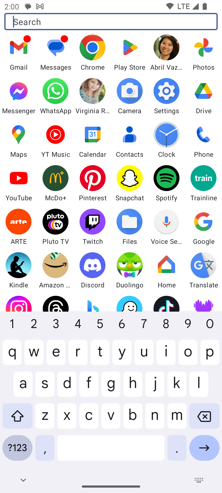
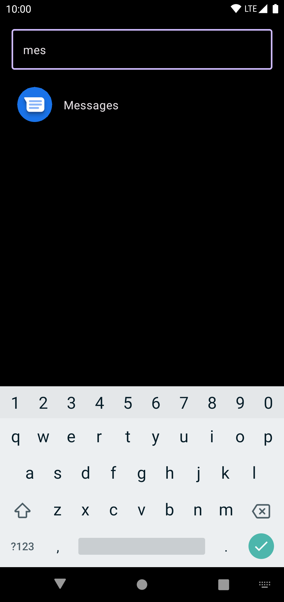
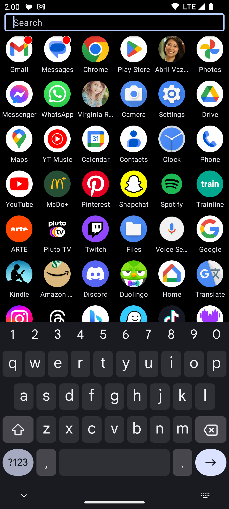
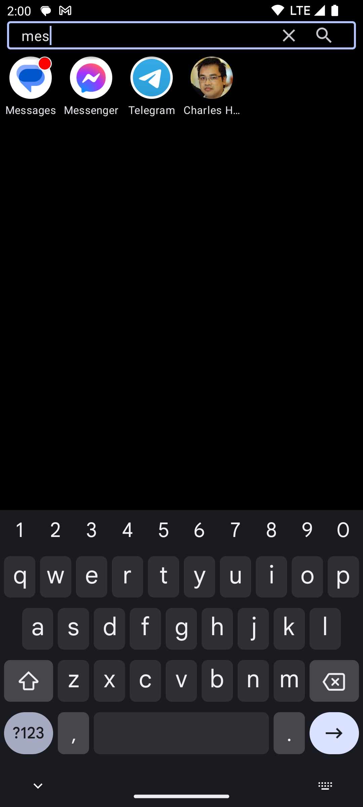

# a

A **minimalist** launcher (home application) for Android.

It's named 'a' because it's the simplest name I could think of.

## Screenshots










## Features

Probably the simplest and quickest way to launch apps:

- Lists apps and favorite contacts
- Most used ones appear at the top of the list
- Keyboard shows up **immediately** so you can start typing to find your item
- Press `Enter` to launch the first item in the list
- Searching for something that's not an app or contact? `Enter` will search the web
- Long tap on an app: show app info, long tap on a contact: launch the SMS app on this contact
- Shows a badge on apps having notifications, and shows them at the top of the list (but you can exclude certain apps from this feature)
- De-prioritize apps to make them appear at the bottom of the list (for apps that aren't used often but can't be uninstalled, e.g. Samsung Browser)
- Shortcuts support
- Dark mode support
- Show most used items at the bottom instead (there's a setting)
- No widgets, no wallpaper, no nonsense (yes, that's a feature)


## Available on Google Play

Find it on Google Play: https://play.google.com/store/apps/details?id=a.a.a.a


## License

```
Copyright (C) 2022-present Benoit 'BoD' Lubek (BoD@JRAF.org)

This program is free software: you can redistribute it and/or modify
it under the terms of the GNU General Public License as published by
the Free Software Foundation, either version 3 of the License, or
(at your option) any later version.

This program is distributed in the hope that it will be useful,
but WITHOUT ANY WARRANTY; without even the implied warranty of
MERCHANTABILITY or FITNESS FOR A PARTICULAR PURPOSE.  See the
GNU General Public License for more details.

You should have received a copy of the GNU General Public License
along with this program.  If not, see <http://www.gnu.org/licenses/>.
```
