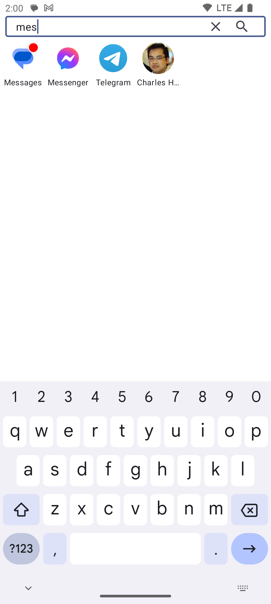

# a

A **minimalist** launcher (home application) for Android.

It's named 'a' because it's the simplest name I could think of.

## Screenshots

## Features

Probably the fastest way to launch an app on Android:

- Lists apps and favorite contacts
- Most used apps appear at the top of the list
- Keyboard shows up **immediately** so you can start typing to find your app
- Press `Enter` to launch the first app in the list
- Searching for something that's not an app? `Enter` will search the web
- Long tap on an app: app info, long tap on a contact: launch the SMS app on this contact
- Shows a badge on apps having notifications, and displays them at the top of the list (but you can exclude certain apps from this feature)
- De-prioritize apps to make them appear at the bottom of the list (for apps that aren't used often but can't be uninstalled, e.g. Samsung Browser)
- Shortcuts support
- Dark mode support
- No widgets, no wallpaper, no nonsense (yes, that's a feature)
